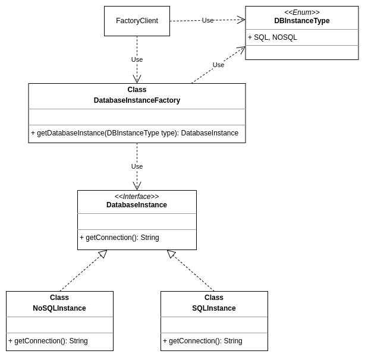

## Pattern Criacional - Factory Method

Objetivo: abstrair do cliente a lógica de criação de objetos, define uma interface comum para criação de um objeto onde as subclasses tomarão a 
decisão de qual instância a ser criada. Também permite adiar a instanciação para subclasses;

Aplicabilidade: use o padrão Factory Method quando:
* Uma classe não pode antecipar a classe de objetos que devem criar;
* Uma classe quer que suas subclasses especifiquem os objetos que criam.

Prós:
* Evita acoplamentos devido à abstração entre o cliente que quer obter a instância e o local em que a instância concreta é criada;
* Single Responsability Principle pois permite separar muito bem a criação de cada tipo de instância;
* Open Closed Principle pois permite introduzir novas especialização de instância sem impactar as existentes.

Contras:
* Torna o código mais complexo devido ao número de subclasses criadas.

### Exemplo esquematizado:

A interface `DatabaseInstance` define um método comum para classes responsáveis por entregar conexões com instâncias de diferentes tipos bancos de dados.
As classes `NoSQLInstance` e `SQLInstance` são as especializações que implementam a interface `DatabaseInstance`.
`DatabaseInstanceFactory` entrega ao `FactoryClient` uma instância específica de `DatabaseInstance` baseada no `DBInstanceType` que o client fornece, podendo ser `SQL` ou `NOSQL`.

