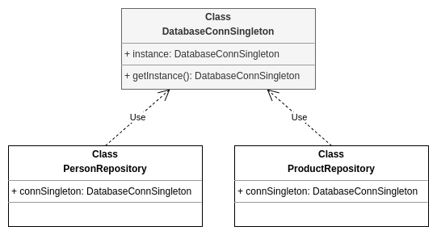

## Pattern Criacional - Singleton

Objetivo: garantir que somente uma instância de um recurso seja provida em 
todo o sistema. 

Utilidade: conexões com banco de dados, loggers e outros recursos compartilhados.

Prós:
* Ponto de acesso global para a instância;
* Garantia de que a classe terá somente uma instância;

Contras:
* Torna testes difíceis dado que o construtor é privado e método estático não
pode ser sobrescrito;
* Em cenários multithread a implementação deve ser pensada para evitar que múltiplas
threads crie o singleton mais de uma vez.

### Exemplo esquematizado:

PersonRepository e ProductRepository usam a mesma e somente uma instância de DatabaseConnSingleton.

